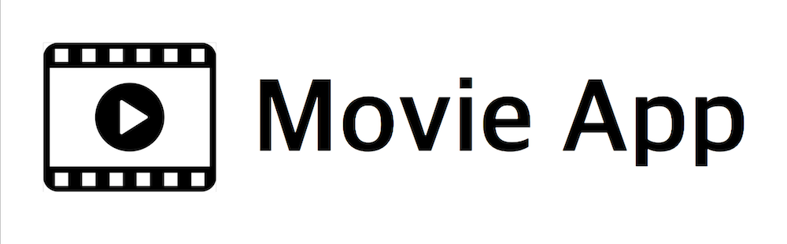

# Movie App



> ## Contents

- [Introduction](#Introduction)
- [Installation](#Installation)
- [Requirement](#Requirement)
- [Features](#Features)
- [Learning points](#Learning-points)

> ### Introduction

최신 개봉된 영화를 한 눈에 볼 수 있는 웹 어플리케이션.


> ### Installation

#### - Client

```
git clone https://github.com/MrKamake/Movie-App.git
cd movie-app-client
yarn install
yarn start
```

> ### Requirement

- Create Api Key in client environment

```
.env
REACT_APP_API_KEY=844dba0bfd8f3a4f3799f6130ef9e335
```

> ### Features

- 최신 영화를 모두 한 페이지에서 볼 수 있습니다.
- 아래로 스크롤하면 개봉일에 따라 다른 영화를 볼 수 있습니다.
- 영화를 클릭해서 상세 페이지로 이동할 수 있습니다.
- 각 영화의 상세 페이지에서 평점, 배우 등과 같은 정보를 확인할 수 있습니다.

> ### Learning points

- **프로그래밍적 사고**

  : 전체적인 구조나 설계, 태스크에 따른 시간관리를 이번 과제를 진행하면서 구현을 시작하기 전에 코드에 품질에 대해 더욱 고민하며 프로그래밍을 해야하는 것을 배웠습니다.

- **Api**

  : 구현에 필요한 데이터를 얻기위해서 Api 문서를 열심히 찾으면서 인내심과 찾아가는 과정을 배웠습니다.

- **git**

  : git으로 버전 관리를 했습니다. 제가 생각하는 코딩 철학은 함께 협업하는 동료들과 나를 위한 배려가 있는 코드여야 한다고 생각하는데, 진행상황과 커밋 메세지가 자연스럽게 어우러지지 못한 점이 아쉬웠습니다. 다음엔 git을 사용하는 것에 조금 더 신경쓰고 싶습니다.

- **Bonus features**

  : Client와 Test 등과 함께 Server까지 완성하려고 했지만 시간이 넉넉치 못했다는 것을 깨달았습니다. 하나라도 제대로 구현 되지 않은채로 과제를 완성하고 싶지 않아서 Server(Bonus features)구현을 중단했습니다. 대신 기본적인 구현에 더욱 신경썼습니다.

> ### Thank you

미용예술학을 전공한만큼 뷰티에 대한 기초지식과 관심이 많습니다. 개발자의 길을 걷다가 뷰티 산업에 개발을 함께하는 블렌디드를 발견했습니다. 뷰티와 개발을 함께 즐기는 것에 매력을 더 느꼈습니다. 그런 블렌디드의 하나의 일원이 되고 싶습니다. 감사합니다!
